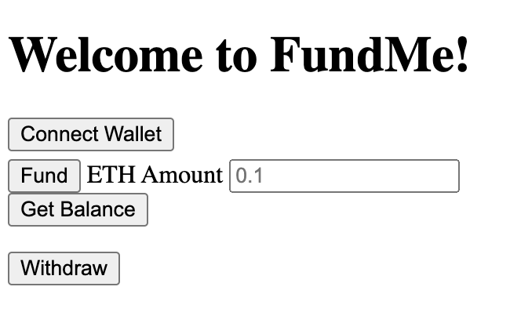

# HTML-FundMe-Front-End  

  - [Description](#description)
  - [Installation](#installation)
  - [Usage](#usage)
  - [Contributions](#contributions)
  - [Tests](#tests)
  - [Questions](#questions)
  - [License?](#license)

  ## Description
 
  A basic front end setup that connects to the HH-FundMe project in a seperate repository. The site allows the user to connect a Metamask wallet, fund the contract with ETH, check the current balance, and withdraw all funds from the contract. 

  ## Installation

  ```git clone https://github.com/guitarkeegan/html-fundme-fcc```, then right-click on the HTML file and open in your prefered browser to view the site. You will also need to clone the back end to this project to run locally. ```git clone git@github.com:guitarkeegan/html-fundme-fcc.git```. 
  Navigate to the html-fundme-fcc directory and run ```yarn hardhat node``` then open the front end to interact with the contract locally. 

  ## Metamask Setup

  After you've installed a Metamask extension for your browser, click the image in the upper-right corner, click settings, networks, add network, call it Hardhat-localhost, under New RPC URL http://127.0.0.1:8545/, Chain ID 31337, currency ETH. 

  After you spin up the back end with ```yarn hardat node```, you'll see a bunch of sample accounts printed out to the terminal. Copy the private key from one of them into your Metamask and you'll be rich with fake ETH!!! At this point, you should be able to the interact with the contract on the front end!

  ## Usage

  > The application allows a simple interface for a user to interact with a smart contract. 

  ## Contributions
  
  Patrick Collins provided a tutorial through Free Code Camp, and this is my version of the project.

  ## Tests

  n/a

  ## Questions

  [My Github profile](https://github.com/guitarkeegan)

  Send me and email [here](mailto:keegananglim@gmail.com) to contact me directly.

  ## License
  This project is licensed under the [MIT License](https://choosealicense.com/licenses/mit/) - click the link to read the license.
  
 
 ## Preview

 